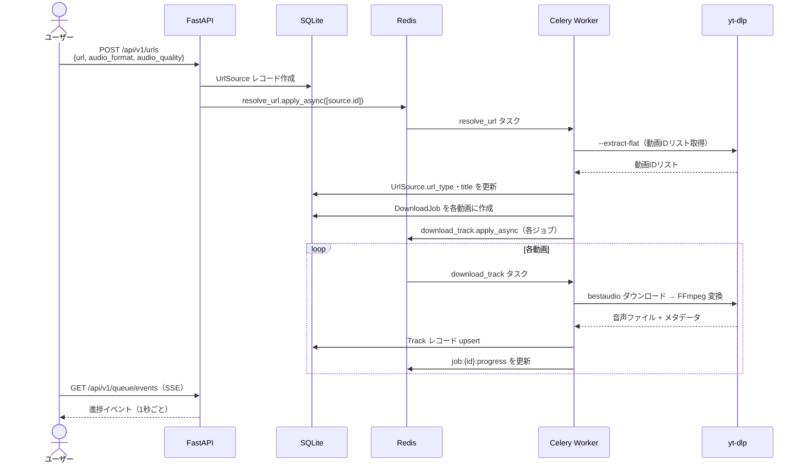
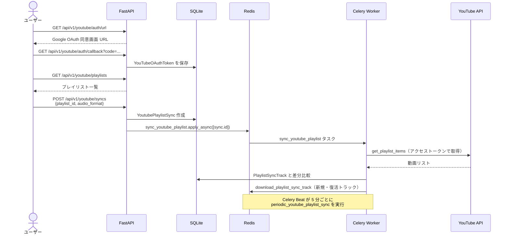
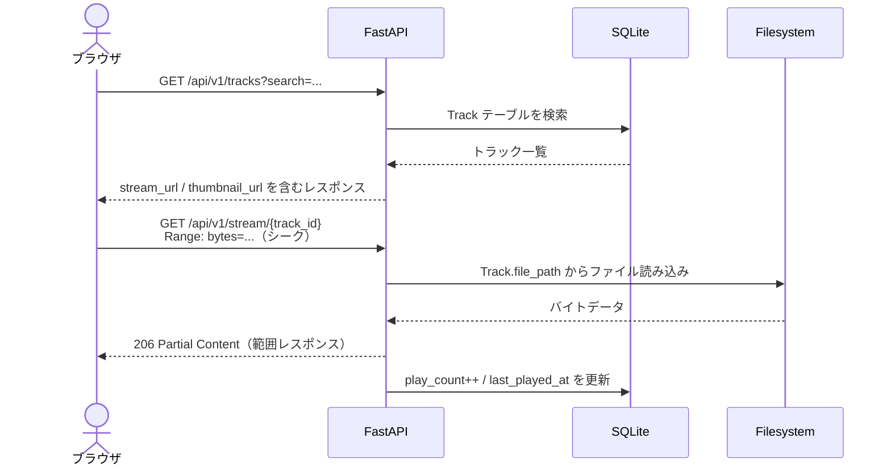
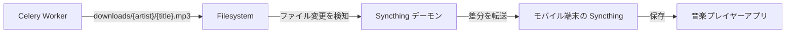
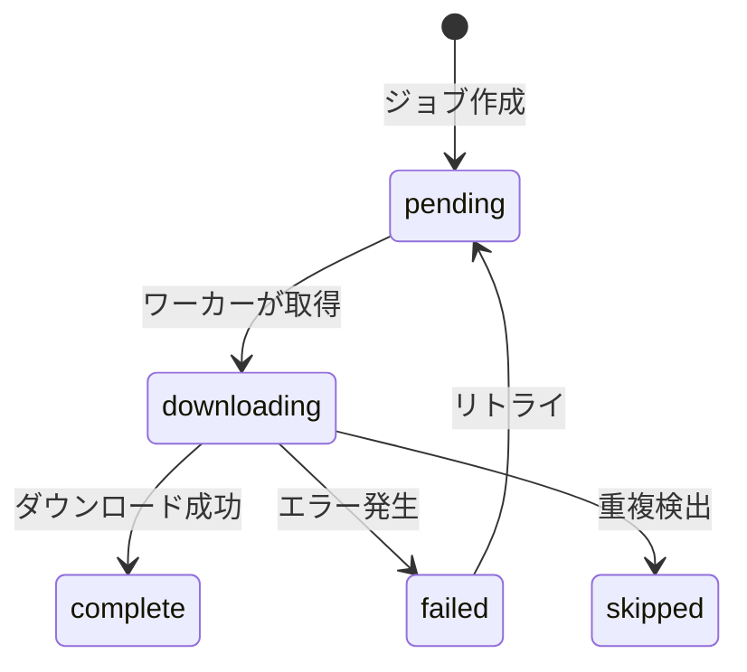
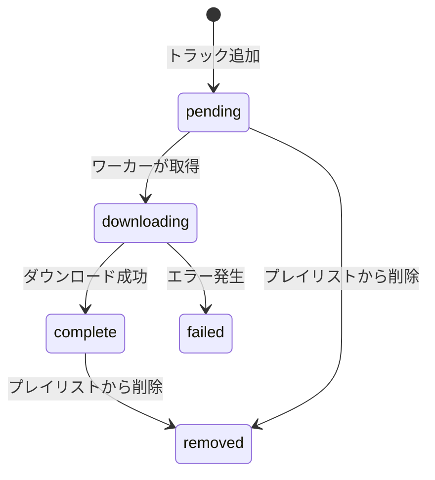

# データフロー

## 1. URL 登録からダウンロードまで

---

## 2. YouTube プレイリスト同期フロー

---

## 3. 音楽再生フロー

---

## 4. Syncthing 同期フロー

---

## 状態遷移

### DownloadJob

| 状態 | 説明 |
|------|------|
| `pending` | キュー待ち |
| `downloading` | yt-dlp ダウンロード中 |
| `complete` | 完了（Track レコードあり） |
| `failed` | エラー（`error_message` に詳細） |
| `skipped` | 重複等でスキップ |

### PlaylistSyncTrack

