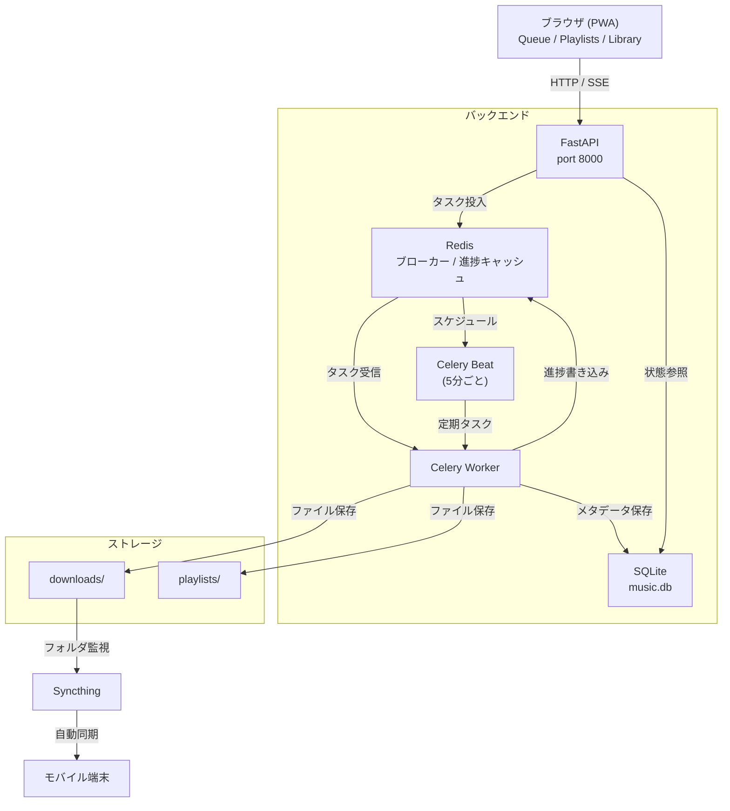

# システムアーキテクチャ概要

## コンポーネント構成

---

## 主要コンポーネント

### FastAPI (`backend/app/main.py`)

- **Uvicorn** ASGI サーバー上で動作
- 起動時に `downloads/`・`data/`・`playlists/` を作成し、DB スキーマを初期化
- フロントエンド静的ファイルを `/` にマウント
- API ドキュメント: `/api/docs`（Swagger UI）、`/api/redoc`（ReDoc）

### Celery ワーカー (`backend/app/tasks/`)

| キュー | 処理内容 |
|--------|---------|
| `downloads` | URL 解決・トラックダウンロード・プレイリスト同期 |
| `scheduler` | 定期ジョブ（5 分ごとに起動） |

- ブローカー: Redis DB 0
- リザルトバックエンド: Redis DB 1
- Beat スケジューラが `periodic_playlist_refresh` と `periodic_youtube_playlist_sync` を定期実行

### Redis

| 用途 | キー例 |
|------|--------|
| Celery ブローカー | — |
| Celery リザルト | — |
| ダウンロード進捗 | `job:{id}:progress`（TTL 300 秒） |
| プレイリスト同期進捗 | `pstrack:{id}:progress`（TTL 300 秒） |

### SQLite データベース

7 テーブルで構成される永続ストア。詳細は [データベース仕様](../backend/database.md) を参照。

### Syncthing

外部サービスとして動作。`downloads/` フォルダを監視し、登録デバイスへ自動同期する。  
Syncthing REST API 経由で同期状態を取得する。

---

## テクノロジースタック

| レイヤー | 技術 |
|---------|------|
| バックエンドフレームワーク | FastAPI 0.111+ |
| ASGI サーバー | Uvicorn 0.29+ |
| データベース ORM | SQLAlchemy 2.0+ |
| データベース | SQLite |
| マイグレーション | Alembic 1.13+ |
| タスクキュー | Celery 5.4+ |
| メッセージブローカー | Redis 7+ |
| ダウンロードツール | yt-dlp 2024.5.1+ |
| 音声処理 | FFmpeg（yt-dlp 経由） |
| 外部同期 | Syncthing |
| フロントエンド | バニラ JS（ES6 モジュール） |
| スタイリング | プレーン CSS（レスポンシブ） |
| PWA | Service Worker + Web App Manifest |
| テスト | pytest 8.0+ |
| コンテナ | Docker + Docker Compose |
