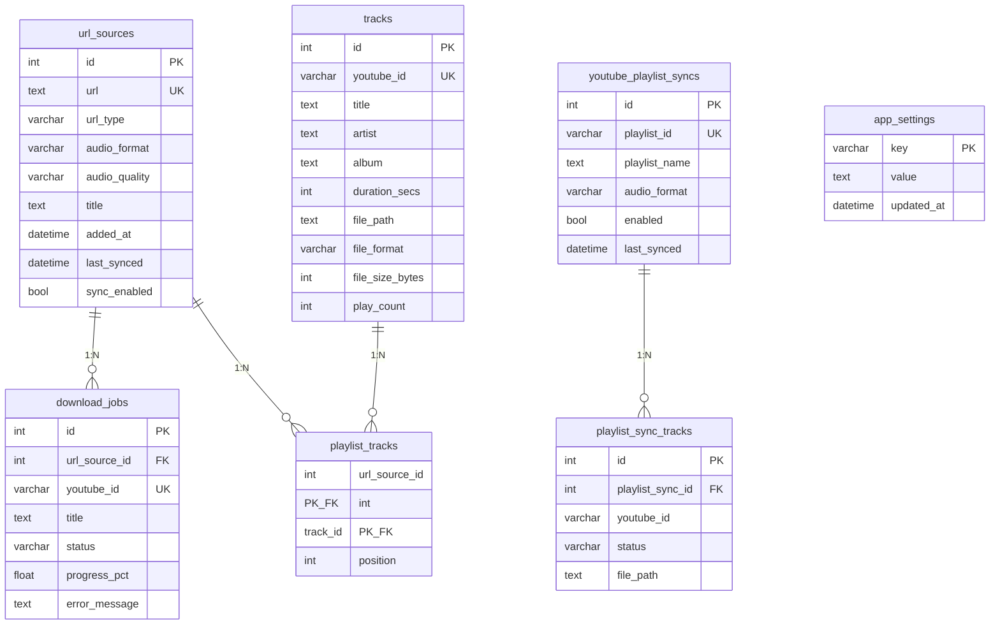

# データベース仕様

SQLite を使用し、SQLAlchemy 2.0+ の Mapped 型アノテーションで定義されます。起動時に `Base.metadata.create_all()` でスキーマを自動生成します。

## ER 図



## マイグレーション

スキーマ変更には Alembic を使用します（`backend/` ディレクトリで実行）:

```bash
alembic upgrade head                         # 最新に適用
alembic revision --autogenerate -m "説明"    # 変更後に生成
alembic downgrade -1                         # 1 つ前に戻す
```

---

## テーブル仕様

### `url_sources` — 登録済み YouTube URL

| カラム | 型 | 説明 |
|--------|-----|------|
| `id` | INTEGER PK | 自動採番 |
| `url` | TEXT UNIQUE | YouTube URL |
| `url_type` | VARCHAR(20) | `video` / `playlist` / `channel` |
| `audio_format` | VARCHAR(10) | `mp3` / `flac` / `aac` / `ogg`（デフォルト: `mp3`） |
| `audio_quality` | VARCHAR(10) | `192` / `320` / `best`（デフォルト: `192`） |
| `title` | TEXT | プレイリスト・チャンネル名（ワーカーが設定） |
| `added_at` | DATETIME | 登録日時 |
| `last_synced` | DATETIME | 最終同期日時 |
| `sync_enabled` | BOOLEAN | 定期同期の有効/無効（デフォルト: `true`） |

**リレーション**: `download_jobs`（1:N、カスケード削除）、`playlist_tracks`（1:N、カスケード削除）

---

### `download_jobs` — ダウンロードジョブ

| カラム | 型 | 説明 |
|--------|-----|------|
| `id` | INTEGER PK | 自動採番 |
| `url_source_id` | INTEGER FK | `url_sources.id`（カスケード削除） |
| `youtube_id` | VARCHAR(20) UNIQUE | YouTube 動画 ID |
| `title` | TEXT | 動画タイトル（`resolve_url` が設定） |
| `status` | VARCHAR(20) | `pending` / `downloading` / `complete` / `failed` / `skipped` |
| `progress_pct` | FLOAT | 進捗率（0.0〜100.0） |
| `celery_task_id` | VARCHAR(64) | Celery タスク ID |
| `error_message` | TEXT | エラー詳細（最大 500 文字） |
| `created_at` | DATETIME | 作成日時 |
| `started_at` | DATETIME | 開始日時 |
| `finished_at` | DATETIME | 完了日時 |

---

### `tracks` — ダウンロード済みトラック

| カラム | 型 | 説明 |
|--------|-----|------|
| `id` | INTEGER PK | 自動採番 |
| `youtube_id` | VARCHAR(20) UNIQUE | YouTube 動画 ID |
| `title` | TEXT | 曲タイトル |
| `artist` | TEXT | アーティスト名（YouTube uploader） |
| `album` | TEXT | アルバム名（プレイリスト名） |
| `duration_secs` | INTEGER | 再生時間（秒） |
| `file_path` | TEXT | 音声ファイルの絶対パス |
| `file_format` | VARCHAR(10) | `mp3` / `flac` / `aac` / `ogg` |
| `file_size_bytes` | INTEGER | ファイルサイズ（バイト） |
| `thumbnail_path` | TEXT | サムネイル画像の絶対パス |
| `added_at` | DATETIME | 追加日時 |
| `last_played_at` | DATETIME | 最終再生日時 |
| `play_count` | INTEGER | 再生回数（デフォルト: 0） |

---

### `playlist_tracks` — URL ソースとトラックの中間テーブル

| カラム | 型 | 説明 |
|--------|-----|------|
| `url_source_id` | INTEGER PK,FK | `url_sources.id` |
| `track_id` | INTEGER PK,FK | `tracks.id` |
| `position` | INTEGER | プレイリスト内の順序 |

**制約**: `(url_source_id, track_id)` の複合ユニーク

---

### `youtube_oauth_tokens` — Google OAuth2 トークン

1 レコードのみ使用します。

| カラム | 型 | 説明 |
|--------|-----|------|
| `id` | INTEGER PK | 自動採番 |
| `access_token` | TEXT | アクセストークン |
| `refresh_token` | TEXT | リフレッシュトークン |
| `token_expiry` | DATETIME | アクセストークンの有効期限 |
| `scope` | TEXT | 付与されたスコープ |
| `created_at` | DATETIME | 作成日時 |
| `updated_at` | DATETIME | 更新日時 |

---

### `youtube_playlist_syncs` — YouTube プレイリスト同期設定

| カラム | 型 | 説明 |
|--------|-----|------|
| `id` | INTEGER PK | 自動採番 |
| `playlist_id` | VARCHAR(64) UNIQUE | YouTube プレイリスト ID |
| `playlist_name` | TEXT | プレイリスト名 |
| `audio_format` | VARCHAR(10) | デフォルト: `mp3` |
| `audio_quality` | VARCHAR(10) | デフォルト: `192` |
| `enabled` | BOOLEAN | 有効/無効（デフォルト: `true`） |
| `last_synced` | DATETIME | 最終同期日時 |
| `created_at` | DATETIME | 作成日時 |

**リレーション**: `playlist_sync_tracks`（1:N、カスケード削除）

---

### `playlist_sync_tracks` — 同期プレイリストの個別トラック

| カラム | 型 | 説明 |
|--------|-----|------|
| `id` | INTEGER PK | 自動採番 |
| `playlist_sync_id` | INTEGER FK | `youtube_playlist_syncs.id` |
| `youtube_id` | VARCHAR(20) | YouTube 動画 ID |
| `title` | TEXT | 曲タイトル |
| `artist` | TEXT | アーティスト名 |
| `duration_secs` | INTEGER | 再生時間（秒） |
| `position` | INTEGER | プレイリスト内の順序 |
| `status` | VARCHAR(20) | `pending` / `downloading` / `complete` / `failed` / `removed` |
| `file_path` | TEXT | 音声ファイルパス |
| `file_format` | VARCHAR(10) | ファイルフォーマット |
| `file_size_bytes` | INTEGER | ファイルサイズ |
| `thumbnail_path` | TEXT | サムネイル画像パス |
| `error_message` | TEXT | エラーメッセージ |
| `added_at` | DATETIME | 追加日時 |
| `downloaded_at` | DATETIME | ダウンロード完了日時 |

**制約**: `(playlist_sync_id, youtube_id)` の複合ユニーク

---

### `app_settings` — アプリケーション設定 KV ストア

| カラム | 型 | 説明 |
|--------|-----|------|
| `key` | VARCHAR(64) PK | 設定キー |
| `value` | TEXT | 設定値 |
| `updated_at` | DATETIME | 更新日時 |

**使用キー**

| キー | デフォルト | 説明 |
|------|-----------|------|
| `url_sync_interval_minutes` | `60` | URL 再解決の間隔（分）、`0` で無効 |
| `youtube_sync_interval_minutes` | `60` | YouTube 同期の間隔（分）、`0` で無効 |
| `url_sync_last_run` | — | URL 同期の最終実行日時（ISO 形式） |
| `youtube_sync_last_run` | — | YouTube 同期の最終実行日時（ISO 形式） |
