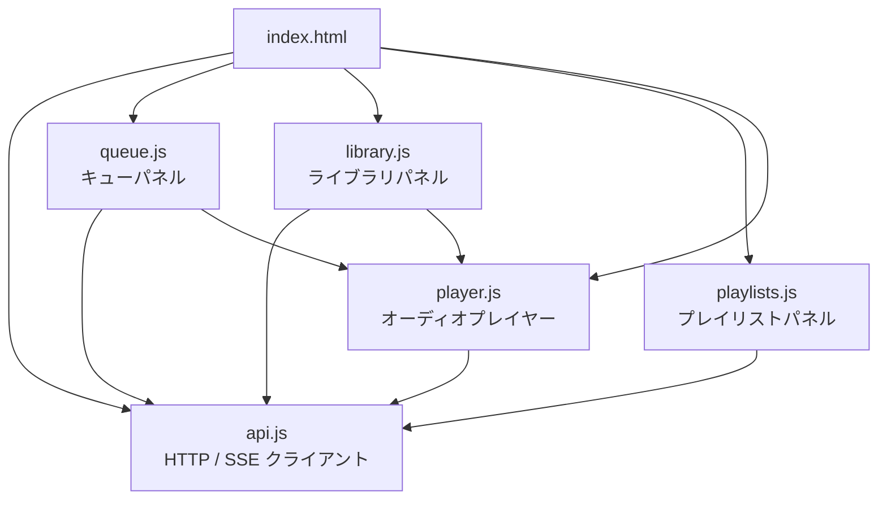
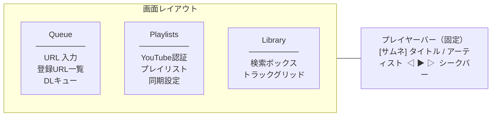

# フロントエンド概要

フレームワークなしの **バニラ JavaScript（ES6 モジュール）** と **プレーン CSS** で構築されています。

## ディレクトリ構成

```
frontend/
├── index.html        # メイン UI（3 パネルレイアウト）
├── manifest.json     # PWA マニフェスト
├── sw.js             # Service Worker
├── css/
│   └── app.css       # レスポンシブ CSS
└── js/
    ├── api.js        # HTTP クライアント + SSE
    ├── queue.js      # キューパネル
    ├── library.js    # ライブラリパネル
    ├── playlists.js  # プレイリストパネル
    └── player.js     # オーディオプレイヤー
```

## モジュール依存関係



---

## UI レイアウト

### デスクトップ（3 カラム）



### モバイル

画面上部のタブバーで Queue / Playlists / Library を切り替えます。プレイヤーバーは常に下部に固定表示されます。

---

## API クライアント (`api.js`)

すべてのモジュールが `api.js` をインポートして使用します。

### `api` オブジェクト

```javascript
// URL 管理
api.addUrl(payload)              // POST /urls
api.listUrls()                   // GET  /urls
api.deleteUrl(id, deleteFiles)   // DELETE /urls/{id}

// キュー管理
api.listQueue(status)            // GET  /queue
api.cancelJob(id)                // DELETE /queue/{id}
api.retryJob(id)                 // POST /queue/{id}/retry

// トラック管理
api.listTracks(params)           // GET  /tracks
api.updateTrack(id, data)        // PATCH /tracks/{id}
api.deleteTrack(id, deleteFile)  // DELETE /tracks/{id}

// YouTube プレイリスト
api.youtubeAuthUrl()             // GET  /youtube/auth/url
api.youtubeAuthStatus()          // GET  /youtube/auth/status
api.youtubeListAccountPlaylists()// GET  /youtube/playlists
api.youtubeCreateSync(payload)   // POST /youtube/syncs
api.youtubeUpdateSync(id, data)  // PATCH /youtube/syncs/{id}
api.youtubeSyncNow(id)           // POST /youtube/syncs/{id}/run

// その他
api.syncthingStatus()            // GET  /syncthing/status
api.getSettings()                // GET  /settings
api.updateSettings(payload)      // PATCH /settings
```

### SSE キュー購読

```javascript
const es = subscribeQueueEvents((jobs) => {
  jobs.forEach(job => updateProgressUI(job));
});
// 購読停止: es.close();
```

API エラー時はレスポンスの `detail` フィールドから `Error` を throw します。
