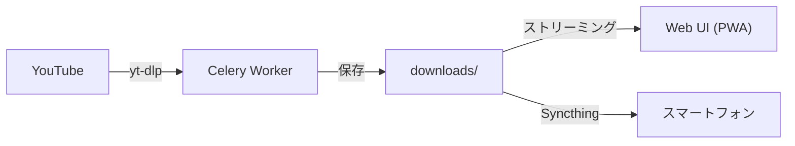

# SyncTune Hub

**YouTube から音楽をダウンロードし、ローカルネットワークでストリーミング再生するシステムです。**  
Syncthing によるモバイル端末への自動同期にも対応しています。



---

## 主な機能

| 機能 | 説明 |
|------|------|
| **URL ダウンロード** | 動画・プレイリスト・チャンネル URL をバックグラウンドで一括ダウンロード |
| **フォーマット選択** | MP3 / FLAC / AAC / OGG、品質 192 / 320 kbps / best |
| **リアルタイム進捗** | Server-Sent Events でダウンロード状況をリアルタイム表示 |
| **YouTube プレイリスト同期** | Google アカウント連携で自動同期（OAuth2 / トークン直接入力） |
| **ブラウザ再生** | Web UI からストリーミング再生（Range リクエスト・シーク対応） |
| **Syncthing 連携** | `downloads/` フォルダをモバイル端末へ自動同期 |
| **PWA 対応** | オフライン再生・ホーム画面追加 |
| **定期自動同期** | Celery Beat で 5 分ごとにプレイリスト更新をチェック |

---

## クイックスタート

=== "Docker（推奨）"

    ```bash
    cp .env.example .env
    # .env を編集して必要な設定を記入
    docker compose up -d
    ```

    ブラウザで `http://localhost:8000` を開きます。

=== "ローカル開発"

    ```bash
    cp .env.example .env
    bash start.sh
    ```

    **前提条件**: Python 3.11+、Redis 7+、FFmpeg  
    詳細は [ローカル開発](deployment/local-dev.md) を参照してください。

---

## システム要件

| 項目 | 要件 |
|------|------|
| **本番環境** | Docker 20.10+ と Docker Compose v2 |
| **ローカル開発** | Python 3.11+、Redis 7+、FFmpeg |
| **モバイル同期** | Syncthing（任意） |
| **YouTube 連携** | Google Cloud Console でのアプリ登録（任意） |

---

## ドキュメント構成

| セクション | 内容 |
|-----------|------|
| [使い方](usage.md) | ダウンロード・再生・プレイリスト同期の操作方法 |
| [アーキテクチャ](architecture/overview.md) | システム構成とデータフロー |
| [バックエンド](backend/index.md) | FastAPI・Celery・DB の仕様 |
| [フロントエンド](frontend/index.md) | バニラ JS / CSS の UI 仕様 |
| [デプロイ](deployment/docker.md) | Docker・Linux セットアップ・環境変数 |
| [Android クライアント](android-client.md) | スマートフォンからの利用方法 |
