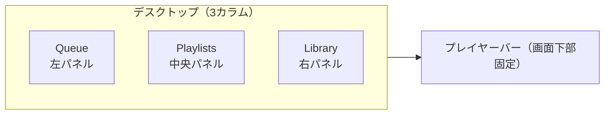

# 使い方ガイド

## 画面構成



デスクトップでは 3 カラムが並んで表示されます。モバイルでは上部タブで切り替えます。

---

## 1. 音楽をダウンロードする（Queue パネル）

### 手順

1. **Queue パネル**（左）上部の入力欄に YouTube URL を貼り付ける
2. フォーマット（MP3 / FLAC / AAC / OGG）と品質（192 / 320 / Best）を選択
3. **「+ Add & Download」** をクリック

登録が完了すると **Registered URLs** に追加され、バックグラウンドでダウンロードが始まります。

### 対応 URL

| 種別 | 例 |
|------|-----|
| 動画 1 件 | `https://www.youtube.com/watch?v=dQw4w9WgXcQ` |
| プレイリスト | `https://www.youtube.com/playlist?list=PLxxxx` |
| チャンネル | `https://www.youtube.com/@ChannelName` |

プレイリスト・チャンネルを登録すると、含まれる全動画がキューに追加されます。

### 進捗の確認

**Download Queue** にリアルタイムで進捗バーが表示されます。

| 表示 | 意味 |
|------|------|
| `pending` | キュー待ち |
| `downloading` + バー | ダウンロード中 |
| `complete` | 完了（Library に追加済み） |
| `failed` + ↺ | 失敗（↺ でリトライ） |

### URL の削除

**Registered URLs** の各行の **✕** をクリックします。ダウンロード済みファイルは削除されません。

---

## 2. 音楽を再生する（Library パネル）

1. **Library パネル**（右）の検索ボックスにタイトルまたはアーティスト名を入力
2. トラックカードをクリックすると **プレイヤーバー** で再生開始

### プレイヤー操作

| ボタン | 動作 |
|--------|------|
| ▶ / ⏸ | 再生 / 一時停止 |
| ⏮ | 前の曲 |
| ⏭ | 次の曲 |
| 🔀 | シャッフル切り替え |
| 🔁 / 🔂 | リピート（全曲 / 1 曲 / オフ） |
| シークバー | 任意の位置にドラッグ |

!!! tip "一括再生"
    トラック一覧で任意の曲をクリックすると、表示中の全トラックがプレイリストとしてセットされます。

### トラック操作

| ボタン | 動作 |
|--------|------|
| **↓** | 音声ファイルをブラウザにダウンロード |
| **🗑** | DB レコード・ファイル・サムネイルをすべて削除（確認あり） |

---

## 3. YouTube プレイリストを自動同期する（Playlists パネル）

### 認証方法を選択

=== "方法 A: OAuth2 で接続（推奨）"

    1. **「YouTubeアカウントに接続」** をクリック
    2. Google のログイン画面でアカウントを選択・許可
    3. 「YouTube接続済み」と表示されたら完了

    !!! note "事前準備"
        `.env` に `YOUTUBE_CLIENT_ID` と `YOUTUBE_CLIENT_SECRET` の設定が必要です。  
        → [環境設定 > YouTube OAuth2 設定](deployment/configuration.md#youtube-oauth2-設定)

=== "方法 B: トークンを直接入力"

    `YOUTUBE_CLIENT_ID` / `YOUTUBE_CLIENT_SECRET` なしで利用できます。

    1. **「トークンを直接入力」** をクリック
    2. [Google OAuth 2.0 Playground](https://developers.google.com/oauthplayground/) でトークンを取得
        - Step 1: `https://www.googleapis.com/auth/youtube.readonly` を入力
        - **「Authorize APIs」** → **「Exchange authorization code for tokens」** を実行
        - **Access token** をコピー（必要なら **Refresh token** も）
    3. フォームに貼り付けて **「保存」** をクリック

    !!! tip "トークンの更新"
        **「トークンを更新」** ボタンから同フォームを再度開けます。  
        Access Token の有効期限は通常 1 時間です。

### プレイリストの同期追加

1. 「アカウントのプレイリスト」から同期したいプレイリストの **「+ 同期追加」** をクリック
2. 「同期中のプレイリスト」に追加され、ダウンロードが自動開始

!!! warning "フォーマット選択"
    現時点では同期追加時のフォーマット・品質はデフォルト（MP3 / 192 kbps）固定です。

### 同期設定の管理

| ボタン | 動作 |
|--------|------|
| **同期** | 今すぐ同期を実行 |
| **一時停止 / 再開** | 自動同期の有効・無効を切り替え |
| **削除** | 設定を削除（ファイルも削除するか選択可） |
| **トラック一覧** | 同期済みトラックの一覧を展開 |

自動同期間隔は「自動同期間隔 / YouTubeプレイリスト」セレクターで変更できます（手動のみ〜24時間）。

---

## 4. Syncthing でモバイルに同期する

`downloads/` フォルダを Syncthing で共有すると、スマートフォンに音楽ファイルを自動転送できます。

### セットアップ手順

1. PC とスマートフォンに [Syncthing](https://syncthing.net/) をインストール
2. PC の Syncthing GUI（`http://localhost:8384`）を開く
3. 設定 → API キーをコピーして `.env` の `SYNCTHING_API_KEY` に設定
4. `downloads/` フォルダを共有フォルダとして追加
5. スマートフォン側でデバイスとフォルダを承認

画面右上の **Syncthing バッジ** で同期状態を確認できます。

| バッジ | 意味 |
|--------|------|
| `Syncthing: off` | 未設定または接続不可 |
| `Syncing…` | 同期中 |
| `Synced 100%` | 同期完了 |

---

## 5. 自動同期間隔を設定する

**Queue パネル下部の「自動同期間隔 / URLキュー」** セレクターで、登録 URL（プレイリスト・チャンネル）の定期チェック間隔を設定します。

| 設定 | 動作 |
|------|------|
| 手動のみ | 自動チェックしない |
| 15分〜24時間 | 指定間隔で全 URL を再チェックし、新着動画を自動ダウンロード |

---

## 6. 管理操作

### DB とファイルシステムの同期

ファイルを手動削除したなど、DB にレコードがあるがファイルが存在しないトラックを一括削除します。

```bash
curl -X POST http://localhost:8000/api/v1/admin/rescan
# → {"removed": 3}
```

### ヘルスチェック

```bash
curl http://localhost:8000/api/v1/health
# → {"status":"ok","redis_connected":true,"db_ok":true,"worker_active":true}
```

| フィールド | 説明 |
|-----------|------|
| `status` | `ok`（正常）または `degraded`（Redis/DB 障害） |
| `redis_connected` | Redis 接続状態 |
| `db_ok` | DB 接続状態 |
| `worker_active` | Celery ワーカーの応答状態 |

---

## 7. よくある問題

??? question "URL を登録してもダウンロードが始まらない"
    Celery ワーカーが起動しているか確認してください。  
    `GET /api/v1/health` で `worker_active: false` の場合はワーカーを再起動します。

    ```bash
    docker compose restart worker
    ```

??? question "ダウンロードが `failed` になる"
    - **Download Queue** の `failed` ジョブの **↺** でリトライできます
    - 非公開・削除済み動画は再試行しても失敗します
    - yt-dlp のバージョンが古い場合は更新が必要です

??? question "音楽が再生できない"
    トラックカードをクリックしても再生バーが表示されない場合、音声ファイルが存在しない可能性があります。
    ```bash
    curl -X POST http://localhost:8000/api/v1/admin/rescan
    ```

??? question "YouTube 認証が失敗する"
    - `.env` の `YOUTUBE_CLIENT_ID`・`YOUTUBE_CLIENT_SECRET` が正しいか確認
    - Google Cloud Console でリダイレクト URI が登録されているか確認

??? question "Syncthing バッジが「off」のまま"
    - `SYNCTHING_API_KEY` が設定されているか確認
    - Syncthing が起動しているか、`SYNCTHING_URL` が正しいか確認
